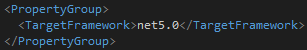
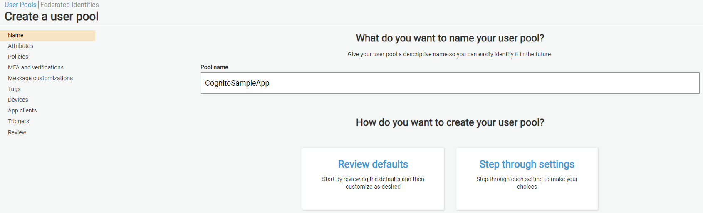
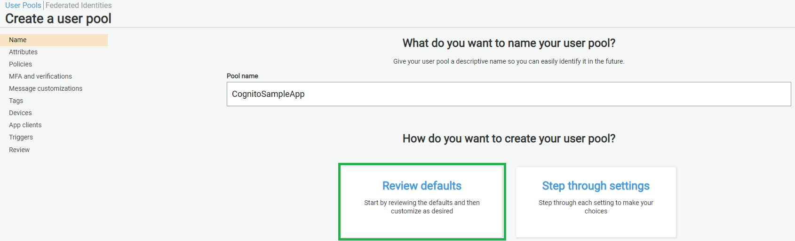
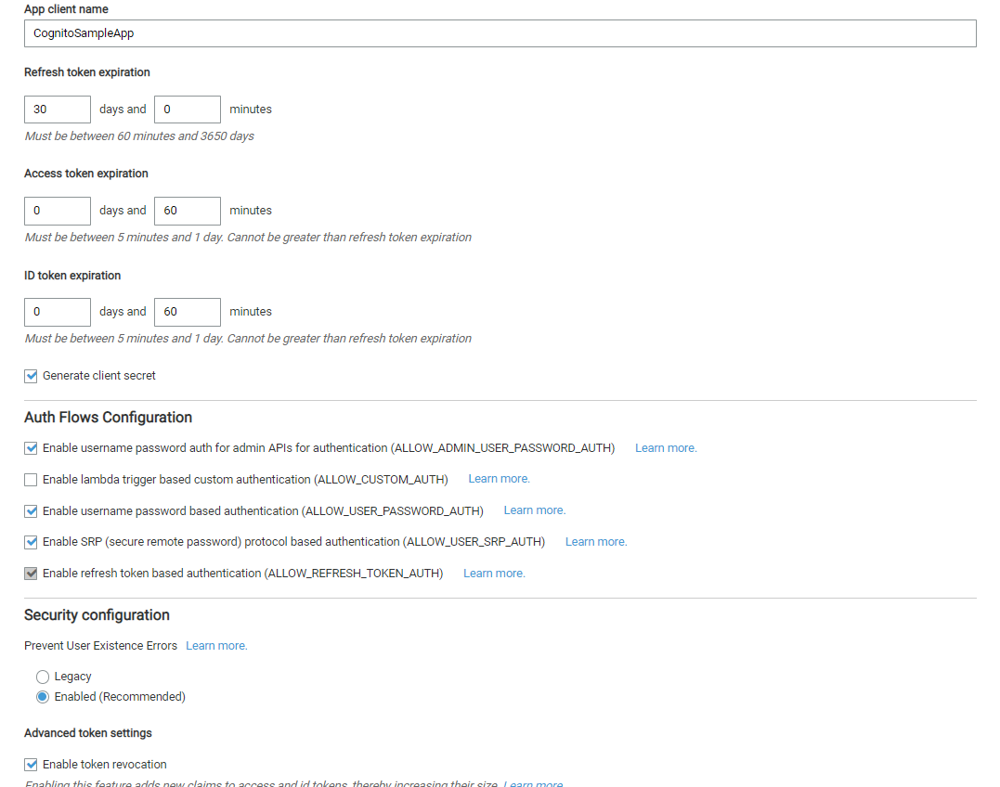
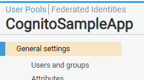
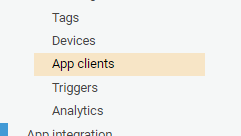
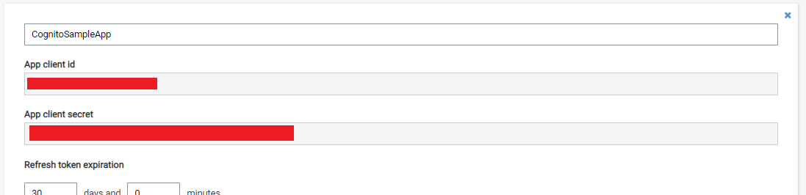

# Cognito Sample App

Using AWS Cognito as authentication provider in ASP.Net Core API.
This example uses c# and .NET 5



## On-line Resources

* [AWS Console](https://console.aws.amazon.com) - AWS console (Requires an AWS Console [Account](https://portal.aws.amazon.com/billing/signup#/start))
* [ASP.NET Core Identity Provider for Amazon Cognito](https://github.com/aws/aws-aspnet-cognito-identity-provider/) - Github repo


## AWS Setup

1. Setup a UserPool using the AWS console.
   1. Provide the name of your pool.  
   
   2. Select Review Defaults  
   
   3. Select Add app client  
   
   4. Create the App Client  
   
	Make Sure the following is selected:
	* Enable username password auth for admin APIs for authentication (ALLOW_ADMIN_USER_PASSWORD_AUTH)
    * Enable username password based authentication (ALLOW_USER_PASSWORD_AUTH)
    * Enable SRP (secure remote password) protocol based authentication (ALLOW_USER_SRP_AUTH)
   5. Select Create app client.
   6. Select Return to pool details.
   7. Select Create pool.
   
    
2. Get AWS Ids & Secrets
   1. UserPoold - This is under the General Settings tab.  
   
   
   2. AppClientId and AppClientSecret - This is under the AppClients Tab.  
   
   
   

## VS Project

### Nuget Packages

* [Microsoft.AspNetCore.Authentication.JwtBearer](https://www.nuget.org/packages/Microsoft.AspNetCore.Authentication.JwtBearer)

```powershell
 Install-Package Microsoft.AspNetCore.Authentication.JwtBearer -Version 5.0.14
```

* [Amazon.AspNetCore.Identity.Cognito](https://www.nuget.org/packages/Amazon.AspNetCore.Identity.Cognito/)

```powershell
 Install-Package Amazon.AspNetCore.Identity.Cognito
```

* [Amazon.Extensions.CognitoAuthentication](https://www.nuget.org/packages/Amazon.Extensions.CognitoAuthentication/)

```powershell
 Install-Package Amazon.Extensions.CognitoAuthentication
```

* [AWSSDK.CognitoIdentityProvider](https://www.nuget.org/packages/AWSSDK.CognitoIdentityProvider/)

```powershell
 Install-Package AWSSDK.CognitoIdentityProvider
```
### appsettings.Development.json

For a development user pool edit either the appsettings.Development.json file or the projects secrets.json file.  
```json
"AWS": {
    "Region": "<your region id goes here>",
    "UserPoolClientId": "<your user pool client id goes here>",
    "UserPoolClientSecret": "<your user pool client secret goes here>",
    "UserPoolId": "<your user pool id goes here>"
}
```
**Note:** If using appsettings.Development.json or some other file in your project structure be careful checking in secrets to source control.

### Startup.cs

```csharp
    public void ConfigureServices(IServiceCollection services)
    {
        // Adds Amazon Cognito as Identity Provider
        services.AddCognitoIdentity();
        
        services.AddAuthentication(options =>
            {
                options.DefaultAuthenticateScheme = JwtBearerDefaults.AuthenticationScheme;
                options.DefaultChallengeScheme = JwtBearerDefaults.AuthenticationScheme;
            })
            .AddJwtBearer(options =>
            {
                options.Authority = $"https://cognito-idp.{this.config.AWS.Region}.amazonaws.com/{this.config.AWS.UserPoolId}";
                options.TokenValidationParameters = new TokenValidationParameters
                {
                    ValidateIssuer = true,
                    ValidIssuer = $"https://cognito-idp.{this.config.AWS.Region}.amazonaws.com/{this.config.AWS.UserPoolId}",
                    ValidateLifetime = true,
                    LifetimeValidator = (before, expires, token, param) => expires > DateTime.UtcNow,
                    ValidateAudience = false,
                };
            });
        ...
    }
```
```csharp
    public void Configure(IApplicationBuilder app, IHostingEnvironment env)
    {
        // If not already enabled, you will need to enable ASP.NET Core authentication
        app.UseAuthentication();
        ...
    }
```


## Gotcha's

* None
